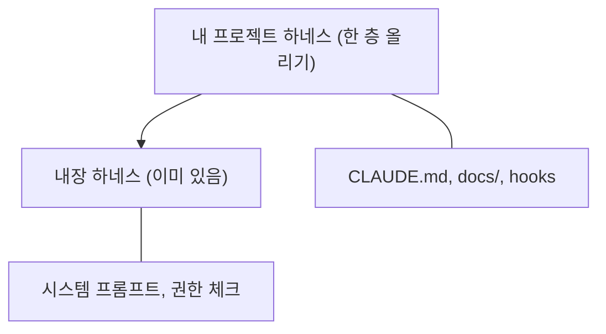
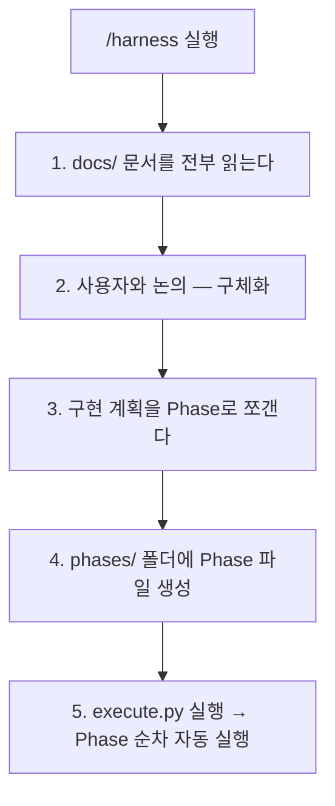

# 하네스 프레임워크 튜토리얼 가이드

---

## 하네스 프레임워크란?

<aside>
💡

**하네스(Harness)**는 AI 코딩 도구가 내 프로젝트 규칙을 따르도록 제어하는 구조화된 프레임워크입니다. Claude Code 위에 "한 층"을 올려서 바이브 코딩의 품질을 높여줍니다.

</aside>

AI 코딩 도구(Claude Code, Cursor, Codex 등)에는 이미 **내장 하네스**가 있습니다 — 위험한 git 명령 차단, 권한 체크, 도구 경계 설정 등. 하지만 이것은 **범용**이라 내 프로젝트만의 아키텍처, 기술 스택, 코딩 규칙은 모릅니다.

이 프레임워크는 그 위에 **프로젝트 전용 하네스**를 올려줍니다:



---

## GitHub 레포지토리

<aside>
📦

**GitHub**: [github.com/jha0313/harness_framework](http://github.com/jha0313/harness_framework)

</aside>

---

## 프레임워크 구조 (4개 레이어)

```
project/
├── CLAUDE.md                    ← 프로젝트 헌법
├── docs/
│   ├── PRD.md                   ← 뭘 만드는지
│   ├── ARCHITECTURE.md          ← 어떻게 만드는지
│   ├── ADR.md                   ← 왜 이렇게 만드는지
│   └── UI_GUIDE.md              ← 어떻게 보여야 하는지 (선택)
├── .claude/
│   ├── commands/
│   │   ├── harness.md           ← /harness — 원스톱 실행
│   │   └── review.md            ← /review — 규칙 기반 리뷰
│   └── settings.json            ← hooks 설정
├── scripts/
│   ├── execute.py               ← Phase 순차 실행 + 상태 관리
│   └── hooks/
│       ├── tdd-guard.sh         ← 테스트 없으면 구현 차단
│       ├── dangerous-cmd-guard.sh ← 위험 명령어 차단
│       └── circuit-breaker.sh   ← 반복 에러 감지
└── phases/                      ← Phase 파일 + 실행 상태
```

---

# Layer 1: docs/ — 프로젝트의 뇌

<aside>
🧠

프레임워크의 핵심입니다. 마크다운 3~4개 파일만 채우면 됩니다.

</aside>

## [PRD.md](http://PRD.md) — 뭘 만드는지

Product Requirements Document. **핵심 기능**과 **MVP 제외 사항**을 정의합니다.

- [PRD.md](http://PRD.md) 템플릿
    
    ```markdown
    # PRD: {프로젝트명}
    
    ## 목표
    {한 줄 요약}
    
    ## 핵심 기능
    1. {기능 1}
    2. {기능 2}
    3. {기능 3}
    
    ## MVP 제외 사항
    - {안 만들 것 1}
    - {안 만들 것 2}
    ```
    

<aside>
⚠️

**MVP 제외 사항**이 매우 중요합니다. 이걸 안 써놓으면 AI가 "이 기능도 추가할까요?" 하면서 scope가 끝없이 늘어납니다. "이건 안 만든다"를 명시하는 게 "이건 만든다"보다 더 중요할 때가 많습니다.

</aside>

## [ARCHITECTURE.md](http://ARCHITECTURE.md) — 어떻게 만드는지

디렉토리 구조, 디자인 패턴, 데이터 흐름을 정의합니다.

- [ARCHITECTURE.md](http://ARCHITECTURE.md) 템플릿
    
    ```markdown
    # 아키텍처
    
    ## 디렉토리 구조
    {폴더 트리}
    
    ## 패턴
    {사용하는 디자인 패턴}
    
    ## 데이터 흐름
    {데이터가 어떻게 흐르는지}
    ```
    

## [ADR.md](http://ADR.md) — 왜 이렇게 만드는지

Architecture Decision Records. **"뭘 선택했고, 왜 선택했고, 뭘 포기했는지"** 세 줄을 적습니다.

- [ADR.md](http://ADR.md) 템플릿
    
    ```markdown
    # Architecture Decision Records
    
    ### ADR-001: {결정 사항}
    **결정**: {뭘 선택했는지}
    **이유**: {왜 선택했는지}
    **트레이드오프**: {뭘 포기했는지}
    ```
    

<aside>
💡

**트레이드오프가 핵심입니다.** 예: "Recharts를 선택했다. D3.js 대비 커스터마이징이 제한되지만 대시보드 수준에서는 충분하다" → AI가 나중에 "D3.js로 바꿀까요?" 같은 제안을 하지 않습니다.

</aside>

## UI_[GUIDE.md](http://GUIDE.md) — 어떻게 보여야 하는지 (선택)

색상 팔레트, 컴포넌트 패턴, **AI 슬롭 안티패턴**(glass morphism 남용, 보라색 그라데이션 텍스트, 네온 글로우 등)을 명시합니다.

<aside>
⚠️

**UI 가이드 없이 실행하면** AI가 기본 스타일 그대로 출력합니다. 디자인 품질을 원한다면 반드시 작성하세요.

</aside>

---

# Layer 2: [CLAUDE.md](http://CLAUDE.md) — 프로젝트의 헌법

AI가 코딩할 때 **제일 먼저 읽는 파일**입니다.

- [CLAUDE.md](http://CLAUDE.md) 템플릿
    
    ```markdown
    # 프로젝트: {프로젝트명}
    
    ## 기술 스택
    - {프레임워크}
    - {언어}
    - {주요 라이브러리}
    
    ## 아키텍처 규칙
    - CRITICAL: {절대 지켜야 할 규칙 1}
    - CRITICAL: {절대 지켜야 할 규칙 2}
    - {일반 규칙들}
    
    ## 개발 프로세스
    - CRITICAL: 새 기능 구현 시 반드시 테스트를 먼저 작성하고, 테스트가 통과하는 구현을 작성할 것 (TDD)
    - 커밋 메시지는 conventional commits 형식을 따를 것
    
    ## 명령어
    {빌드, 테스트, 린트 명령어}
    ```
    

<aside>
🔑

**핵심 포인트 2가지:**

1. **CRITICAL 키워드** — AI가 우선순위 신호로 인식하여 일반 규칙보다 훨씬 강하게 따릅니다
2. **TDD 규칙** — "테스트를 먼저 작성하라" 하나만 넣어도 코드 품질이 크게 올라갑니다
</aside>

---

# Layer 3: 실행 엔진 — /harness + [execute.py](http://execute.py)

## /harness 스킬

`.claude/commands/harness.md`에 정의된 원스톱 실행 스킬입니다. Claude Code에서 `/harness`를 입력하면 실행됩니다.

### 실행 흐름



<aside>
✅

**여러분이 할 일은 docs/ 채우고 `/harness` 치는 것뿐입니다.** 나머지는 프레임워크가 알아서 합니다.

</aside>

## [execute.py](http://execute.py) — Phase 순차 실행

`scripts/execute.py`는 Phase를 순차적으로 실행하는 자동화 스크립트입니다.

### 동작 방식

1. `phases/{task-name}/` 폴더에서 다음 **pending** Phase를 찾는다
2. Phase 파일 내용을 읽어서 Claude에게 넘긴다 (`claude -p` 헤드리스 모드)
3. Claude가 작업을 완료하면 **상태를 체크**한다

| 상태 | 동작 |
| --- | --- |
| completed | 자동 커밋 → 다음 Phase로 |
| error | 에러 기록 + 중단 |
| blocked | 사용자 개입 필요 + 중단 |

### 헤드리스 모드 (`claude -p`)

Claude Code의 자동화 전용 모드입니다. 프롬프트를 텍스트로 넘기면 Claude가 알아서 실행하고 결과를 돌려줍니다.

**대화형 모드** (평소 사용)

- 사람이 채팅하며 주고받기
- 실시간 상호작용

**헤드리스 모드** (`claude -p`)

- 프롬프트 넣으면 알아서 실행
- 사람이 앞에 없어도 됨
- 자동화에 특화

<aside>
💡

[execute.py](http://execute.py)는 Phase마다 **새로운 Claude를 호출**합니다. Phase 1이 끝나면 그 Claude는 종료되고, Phase 2는 새로운 Claude가 시작됩니다. 각 Phase 지시서에 작업 범위가 문서로 제한되어 있으므로 AI가 자기 범위 밖의 일을 하지 않습니다.

</aside>

### 실행 예시

```bash
python3 scripts/execute.py mvp
```

```
==================================================
  Harness Executor
  Task: mvp | Phases: 5 | Pending: 5
==================================================
  ✓ Phase 1: 프로젝트-초기화 [180s]
  ✓ Phase 2: 타입-+-유틸리티 [300s]
  ✓ Phase 3: api-라우트 [240s]
  ✓ Phase 4: ui-컴포넌트 [300s]
  ✓ Phase 5: 메인-페이지-통합 [150s]
==================================================
  Task 'mvp' completed!
==================================================
```

## /review 스킬

프로젝트 규칙에 맞춰 **자동 리뷰**해주는 스킬입니다. 다음 4가지를 자동 체크합니다:

1. [ARCHITECTURE.md](http://ARCHITECTURE.md) 폴더 구조 준수 여부
2. ADR 기술 스택 준수 여부
3. 테스트 작성 여부
4. [CLAUDE.md](http://CLAUDE.md) CRITICAL 규칙 준수 여부

---

# Layer 4: Hooks — 자동 검증 장치

`.claude/settings.json`에 설정하는 자동 검증 스크립트입니다.

| Hook | 기능 | 파일 |
| --- | --- | --- |
| **TDD Guard** | 구현 파일 수정 시 해당 테스트가 없으면 수정을 차단 | `scripts/hooks/tdd-guard.sh` |
| **Dangerous Command Guard** | `rm -rf`, force push, `git reset --hard` 등 위험 명령어 차단 | `scripts/hooks/dangerous-cmd-guard.sh` |
| **Circuit Breaker** | 같은 에러가 60초 안에 5번 반복되면 전략 변경 경고 | `scripts/hooks/circuit-breaker.sh` |

---

# 빠른 시작 가이드

## Step 1: 클론 + 셋업

```bash
git clone https://github.com/jha0313/harness_framework.git my-project
cd my-project
npm install
```

## Step 2: docs/ 채우기 (AI와 함께)

Claude Code를 열고 AI와 대화하며 docs/를 채웁니다.

```
나: "YouTube URL 넣으면 댓글 수집해서 감성 분석하는 대시보드 만들자"
AI: PRD 초안 제안 → 핵심 기능, MVP 제외사항 정리
나: "댓글은 최대 100개로 제한하자."
AI: PRD 수정 → ARCHITECTURE.md, ADR.md도 함께 작성
```

<aside>
💡

혼자 다 쓰는 게 아니라 **AI와 함께 기획**하세요. AI가 놓치기 쉬운 부분을 짚어줍니다.

</aside>

## Step 3: [CLAUDE.md](http://CLAUDE.md)에 CRITICAL 규칙 추가

프로젝트에 맞는 절대 규칙을 넣습니다. 예시:

- `CRITICAL: 모든 API 로직은 app/api/에서만`
- `CRITICAL: API 키는 환경변수로, 코드에 하드코딩 금지`
- `CRITICAL: 새 기능은 테스트 먼저 (TDD)`

## Step 4: 환경변수 설정

프로젝트에 필요한 API 키 등을 `.env.local`에 설정합니다.

```bash
echo "NEXT_PUBLIC_YOUTUBE_API_KEY=your_key
NEXT_PUBLIC_CLAUDE_API_KEY=your_key" > .env.local
```

## Step 5: /harness 실행

Claude Code에서 `/harness`를 입력합니다. AI가 docs/를 읽고 Phase로 분리한 구현 계획을 제안합니다.

## Step 6: [execute.py](http://execute.py)로 자동 실행 (옵셔널)

<aside>
ℹ️

**이 단계는 선택사항입니다.** `/harness` 스킬이 [execute.py](http://execute.py) 실행까지 포함하고 있으므로, Step 5에서 `/harness`를 실행했다면 이 단계를 건너뛰어도 됩니다. 별도로 Phase만 다시 실행하고 싶을 때 사용하세요.

</aside>

```bash
python3 scripts/execute.py mvp
```

## Step 7: 리뷰 + 개선

완성된 결과물을 확인하고, 부족한 부분이 있다면 docs/를 보강한 뒤 다시 실행합니다.

---

# 핵심 교훈

<aside>
🎯

**하네스에 뭘 넣느냐 = 결과의 품질**

프레임워크가 아무리 좋아도 docs가 얕으면 결과도 얕습니다. 코드를 직접 고치는 게 아니라, **AI에게 주는 맥락의 품질을 올리는 것**이 핵심입니다.

</aside>

### 실전 사례: FeedbackPulse

| 문제 | 원인 | 해결 |
| --- | --- | --- |
| UI가 허접하다 | UI 디자인 가이드가 없었음 | `docs/UI_GUIDE.md` 추가 (안티슬롭 패턴 포함) |
| Claude API 파싱 에러 | JSON 응답에서 코드블록 래핑 미처리 | `ADR-009` 추가: 코드블록 strip 규칙 |

→ 같은 프레임워크, 같은 Phase 구조에서 **docs에 가이드 하나 추가했을 뿐**인데 결과물이 확 달라짐

---

# 전체 워크플로우 요약


| 단계 | 누가 | 무엇을 |
| --- | --- | --- |
| 뼈대 | 나 | 프레임워크 레포 클론 |
| 기획 | 나 + AI | docs/ 채우기 (PRD, ARCHITECTURE, ADR) |
| 하네스 설계 | 나 + AI | [CLAUDE.md](http://CLAUDE.md) 규칙 + Hooks 설정 |
| 실행 | AI | /harness → [execute.py](http://execute.py) (Phase 순차 실행) |
| 리뷰 | 나 + AI | 결과물 확인 + docs 보강 + 재실행 |

---

# FAQ

- 비개발자도 사용할 수 있나요?
    
    네. docs/ 폴더의 마크다운 파일만 채우면 됩니다. 코드를 직접 작성할 필요가 없습니다. Claude Code 설치와 기본적인 터미널 사용법만 알면 충분합니다.
    
- oh-my-claudecode 같은 오픈소스와 뭐가 다른가요?
    
    oh-my-claudecode는 19개 에이전트, 파이프라인, 스킬 시스템 등 **풀 세팅 범용 하네스**입니다. 이 프레임워크는 **가벼운 커스텀 하네스**로, docs/에 내 프로젝트만의 규칙을 직접 정의하는 방식입니다. 둘 다 "한 층 올리기"이며, 프로젝트 규모와 필요에 따라 선택하면 됩니다.
    
- Phase는 몇 개가 적당한가요?
    
    MVP 기준 5~7개가 적당합니다. 너무 많으면 각 Phase가 너무 작아지고, 너무 적으면 한 Phase에 너무 많은 작업이 들어갑니다.
    
- [execute.py](http://execute.py) 실행 중 에러가 나면?
    
    에러 상태가 `phase{N}.status.json`에 기록됩니다. 에러 원인을 확인하고, Phase 지시서를 수정한 뒤 다시 실행하면 해당 Phase부터 재개됩니다.
    

---

<aside>
🎬

**관련 영상**: 에이전틱엔지니어링 채널 — 하네스 엔지니어링 실습편

</aside>